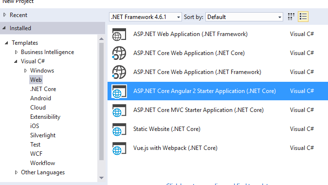
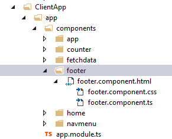
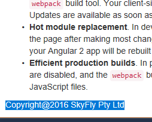

# Ng2 in Aspnet Core

This is the latest ng2 in asp.net core template. it works if we can roughtly understand something in this template.
As the fast changes of the ng 2 technology, the best way for us to use and learn ng 2 is to know how to use ng2 for development. Check blog <a href="http://blog.stevensanderson.com/2016/10/04/angular2-template-for-visual-studio/">here</a> to know how to get started. After we install all necessary packages in visual studio 2015, we can see a new application template is installed in visual studio 2015 as image below shown.

Create a new project from this template, run it, and check the file structure in this project.

##Startup file

we can see new setting has been added in startup file as below

<pre>
app.UseWebpackDevMiddleware(new WebpackDevMiddlewareOptions {
                    HotModuleReplacement = true
                });

            routes.MapSpaFallbackRoute(
                    name: "spa-fallback",
                    defaults: new { controller = "Home", action = "Index" });

</pre>

##Package.json

Using node js, we can install ng2 via commandline tool such as npm install command to get ng2 set up quickly. However, Ng2 in Asp.Net Core seems more complex. luckily .Net guys have built up a good template we can donnload and develop a new ng2 aasp.net core web application.

The first thing in this template we need to know is its ng2 packages in asp.net core. we need to know how the ng2 is integrated into asp.net core easily. Package.json will give you all dependiences you need for ng2 in asp.net core. 

## project.json 

we can see a new lib called "Microsoft.AspNetCore.AngularServices": "1.0.0-*" is added.

##Folder structure in asp.net core

<pre>

1, html, Js, and css should be hosted under wwwroot folder so they can be accessed from public. We do not use typescript in html, therefore, we do not need to put typescript in wwwroot. 

2, compare with asp.net core template, we can see clientApp folder and webpack.config.js are new in this ng2 asp.net core application.

3, The latest vesion of ng2 in asp.net core uses webpack module bundler to replace system.js.

4, The latest ng2 in asp.net template allows us to put all ng2 front end in clientApp folder.

5, We code ts files in clientApp and generate its js files in wwwroot folder for html page access. This process is completed by webpack.config.js component.

6, We can see a vendor js and a vendor manifest json file as well as a main-client.js file in wwwroot folder. vendor js bundles all resource js files we used in here such as jquery.js file ,etc. This can speed up the page load and improve the web performance.

7, All business logic we develop for front end application is wrapped in main-client.js file. from index.cshtml file in /views/home/ folder, we can see how landing page is made in this template:

<pre>

@{
    ViewData["Title"] = "Home Page";
}

<app asp-prerender-module="ClientApp/dist/main-server">Loading...</app> @can be disabled@

@section scripts {
    
}

</pre>

From here we can see main-client.js is the entry point that contains all ng2 programming logic and codes from typescript. That is it. We now can see other file structures are the same as asp.net core web application. it means we still can develop apicontroller or mvc controllers and views for this ng2 front end.

</pre>

##ClientApp folder

Now we can focus on this ng2 asp.net core front end devvelopment by using typescript oo programming language for javascript. 

1, One fact we need to know before we get into this section is, from landing page we can see we do not put any html selectors in. So the first thing we need to do is to create a root element inside body tag so we can start application. We call this root element as "app". So now we have html tags like below

<pre>
  <body>
  <app>
  all landing page's contents come here
  </app>
  </body>
</pre>

We did not add app tag directly into html page, it is an element that should be created by ng2 or html will not recongize this element.

2, Now it is our time to develop a first app element by using ng2. under clientapp folder, we can see a boot-client.ts and boot-server.ts two typescript files. ignore server one, we focus on client ts.

<pre>

import 'angular2-universal-polyfills/browser';
import { enableProdMode } from '@angular/core';
import { platformUniversalDynamic } from 'angular2-universal';
import { AppModule } from './app/app.module';
import 'bootstrap';

</pre>

Typescript is module programming language, it starts from import { AppModule } from './app/app.module'. Therefore, we can understand that app.module is the top level ts module we develop for "app" element. so its selector should be "app", its template should be the layout contains < app>all contens com here.</ app>. This module exports class "AppModule" that typescript can import from. 

3, App.module.ts we now can say as code below

<pre>
  import { Component } from '@angular/core';

  @Component({
      selector: 'app',
      template: require('./app.component.html'),
      styles: [require('./app.component.css')]
  })
  
  export class AppModule {
  }
  
</pre>

require.js AMD is used to load js or css files in ts. this is a cool stuff. Now we can see app.component.html is the contents in < app> contents from app.component.html < /app>. 

However, template gives us a better structure we can organize other dependency modules into this top level app.module.ts. We use @NgModule({
bootstrap: [],
declaration:[],
imports:[]
});

This module contains three property we can use to manage the dependency injection. bootstrap we inject the compoent contains "app" selector, so this component can be load first to create app element in html before any other children elements are created. declaration we declare all components we can use and then inject here. imports allows us to import universal module that contains resources ng2 needs such as jquery js,etc. imports also build up a routing module for http://localhost:xxxx root. for example: 

<pre>
 RouterModule.forRoot([
            { path: '', redirectTo: 'home', pathMatch: 'full' },
            { path: 'home', component: HomeComponent },
            { path: 'counter', component: CounterComponent },
            { path: 'fetch-data', component: FetchDataComponent },
            { path: '**', redirectTo: 'home' }
        ])

  If we type in http://localhost:xxxx/counter url, router will load Countercomponent for page. 
</pre>

Therefore, app.module.ts do some simply stuff to load default component, to load router and references for ng2, etc.

4, app.module.ts children

From 3 we can see that app.module.ts load app.component.html as content of < app>< /app> tag inside < body>< /body>.
We need to know what contents app.component.html require. see example below

<pre>

< div class='container-fluid'>
    < div class='row'>
        < div class='col-sm-3'>
            < nav-menu>< /nav-menu>
        < /div>
        < div class='col-sm-9 body-content'>
            < router-outlet>< /router-outlet> 
            < footer>< /footer>
        < /div>
    < /div>
   
    
</pre>

from this html, we can find that at least we need to create three components children for app.module.ts such as  < nav-menu>,
 < router-outlet> and  < footer>.
 
 So we need to develop other three child components in app folder and import them into app.module.ts module. see footer component i developed for tis template as below
 
 
 
 
##Summary

Now we can see how ng2 in asp.net core works, it looks like we are doing the logo game to build a waterfall from the top to the bottom. the bottom is composed of the ng2 components. 

 
 

